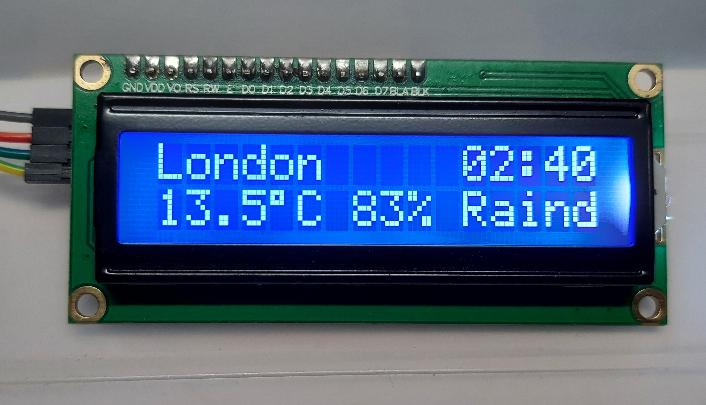
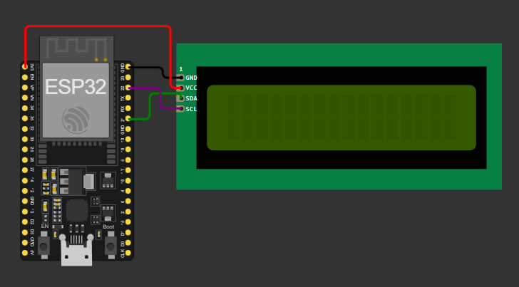
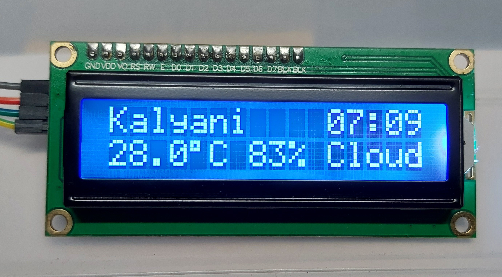

# 🌦️ WeatherSync – Real-Time Weather & Clock on 16x2 LCD (ESP32)

WeatherSync is an **IoT project** that displays **live weather conditions and local time** on a 16x2 I²C LCD using an **ESP32**.
It fetches data from the **OpenWeatherMap API** and adjusts automatically to city-based overrides via the Serial Monitor.



---

## ✨ Features

* 🌍 **Real-Time Weather** → Temperature, Humidity & Weather Condition
* ⏰ **City-Based Clock** → Automatic timezone adjustment from API
* 🏙️ **City Override** → Type any city in Serial Monitor to view its live weather
* 🔄 **Auto-Revert** → Returns to default city after 10 seconds
* 💡 **Minimal Hardware, Maximum Functionality** → Just ESP32 + I²C LCD

---

## 🛠️ Hardware Required

* ESP32 Development Board
* 16x2 I²C LCD Display (PCF8574 backpack)
* Jumper Wires & Breadboard
* WiFi connection

---

## 🔌 Circuit Connections

| ESP32 Pin | LCD Pin |
| --------- | ------- |
| 3.3V / 5V | VCC     |
| GND       | GND     |
| GPIO 21   | SDA     |
| GPIO 22   | SCL     |

*(Default ESP32 I²C pins are GPIO21 for SDA & GPIO22 for SCL)*



---

## 📦 Libraries Used

Make sure to install these Arduino libraries via **Library Manager**:

* `WiFi.h`
* `HTTPClient.h`
* `ArduinoJson`
* `NTPClient`
* `WiFiUdp`
* `LiquidCrystal_I2C`

---

## ⚡ How It Works

1. Connect ESP32 to WiFi.
2. Fetch weather data from **OpenWeatherMap API** using city name.
3. Extract temperature, humidity, and condition.
4. Adjust time using **NTP + API timezone offset**.
5. Display formatted data on a 16x2 LCD.
6. (Optional) Enter a new city via Serial Monitor → shows weather temporarily.

---


## 🚀 Getting Started

1. Clone this repo:

   ```bash
   git clone https://github.com/your-username/WeatherSync.git
   ```
2. Open the sketch in Arduino IDE.
3. Update WiFi credentials and your **OpenWeatherMap API key**:

   ```cpp
   const char* ssid     = "YourWiFiName";
   const char* password = "YourWiFiPass";
   String apiKey        = "YOUR_API_KEY";
   ```
4. Upload to ESP32 and watch real-time weather sync on LCD!

---

## 📌Output

`LCD Row 1:   `City Name    Time hh:mm

`LCD Row 2:   `Temp Humidity Condition

## 📌 Example
```
`Kalyani    07:09`
`28.0°C 83% Cloud`
```



---

## 📜 License

This project is open-source under the **MIT License** – free to use and modify.

---

## 🔗 Connect with Me

💼 [LinkedIn](link)

🐙 [GitHub](Link)


